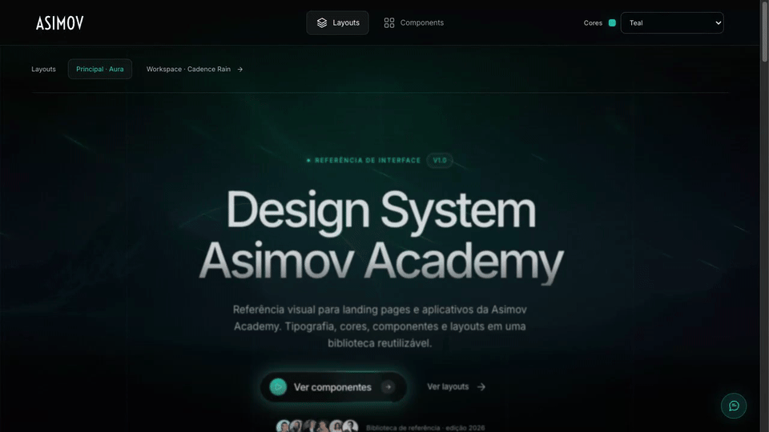

# Asimov Design System



Biblioteca visual autocontida para criar landing pages e aplicativos com a identidade da Asimov Academy. O repositório reúne tokens, componentes, layouts responsivos, fontes, imagens e os fundos animados Aura e Cadence Rain — sem exigir framework, npm ou CDN.

## Como explorar

Abra `index.html` diretamente no navegador ou sirva a pasta localmente:

```bash
python3 -m http.server 4173
```

Depois acesse `http://localhost:4173`.

- `index.html`: composição principal com Aura e paisagem.
- `components.html`: catálogo de componentes e estados.
- `cadence-rain.html`: layout alternativo de workspace.
- `starter.html`: base recomendada para uma nova implementação.

## Como usar com IA

Peça para a IA tratar este diretório como a fonte de verdade visual e ler primeiro `AGENTS.md`, `tokens.json` e `assets/css/tokens.css`. Para novas páginas, indique que ela deve partir de `starter.html` e reutilizar os componentes existentes.

Exemplo de prompt:

```text
Use o design system deste repositório para implementar [descreva a tela].
Leia AGENTS.md antes de começar, use starter.html como base e preserve os
tokens, componentes, acessibilidade, responsividade e efeitos visuais existentes.
Não introduza dependências remotas sem necessidade.
```

Os conteúdos, preços e métricas das páginas são demonstrativos; substitua-os por dados reais na integração.
